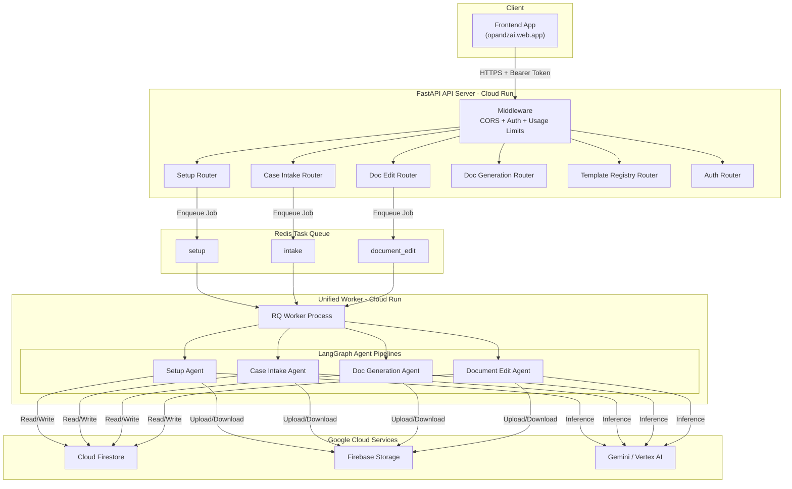
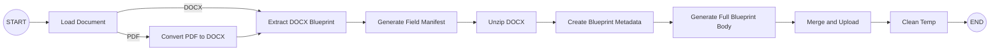
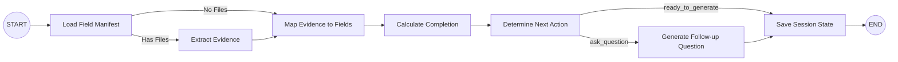
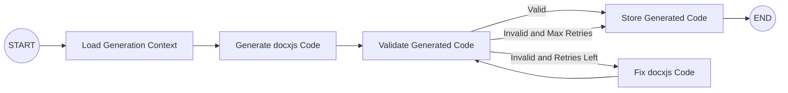
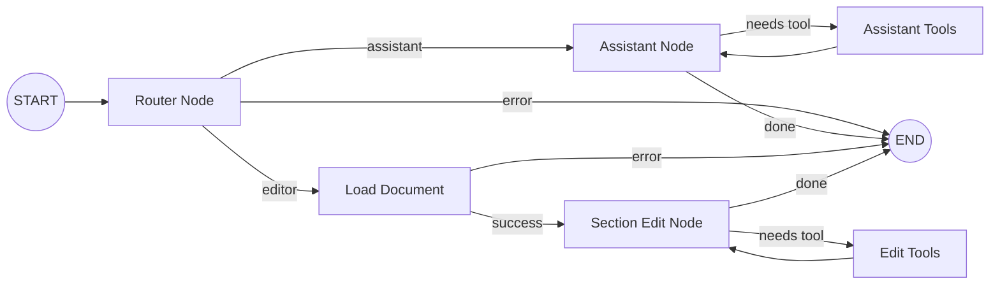

# Opandz AI Backend

> **Intelligent Legal Document Automation Platform**
> Agentic AI system that transforms raw legal templates into structured blueprints, conducts interactive case intake, generates court-ready documents, and enables AI-powered document editing — all through a production-grade API.

---

## Table of Contents

- [System Overview](#system-overview)
- [Technology Stack](#technology-stack)
- [High-Level Architecture](#high-level-architecture)
- [Agent Pipelines](#agent-pipelines)
  - [1. Setup Agent](#1-setup-agent)
  - [2. Case Intake Agent](#2-case-intake-agent)
  - [3. Document Generation Agent](#3-document-generation-agent)
  - [4. Document Edit Agent](#4-document-edit-agent)
- [Orchestration Layer](#orchestration-layer)
- [Infrastructure & Deployment](#infrastructure--deployment)
- [API Surface](#api-surface)
- [Security & Auth](#security--auth)
- [Token Tracking & Usage Limits](#token-tracking--usage-limits)
- [Project Structure](#project-structure)

---

## System Overview

Opandz AI Backend is a **multi-agent LLM system** purpose-built for the legal industry. It automates the end-to-end lifecycle of legal document workflows:

```
┌──────────────┐     ┌──────────────┐     ┌──────────────┐     ┌──────────────┐
│   Template   │────▶│    Case      │────▶│   Document   │────▶│   Document   │
│    Setup     │     │   Intake     │     │  Generation  │     │   Editing    │
└──────────────┘     └──────────────┘     └──────────────┘     └──────────────┘
   Upload &            Conversational       Auto-generate         AI-powered
   Blueprint           evidence             court-ready           edits &
   Extraction          gathering            DOCX files            Q&A
```

| Capability | Description |
|---|---|
| **Template Setup** | Upload PDF/DOCX legal templates → extract structural blueprints, field manifests, and metadata via LLM |
| **Case Intake** | Multi-turn conversational agent that gathers case evidence, maps it to template fields, and tracks completion |
| **Document Generation** | Generates production-ready DOCX documents using `docxjs` code synthesis with validation & self-healing |
| **Document Editing** | Dual-mode agent (Assistant + Section Editor) for AI-powered document Q&A and targeted section edits |

---

## Technology Stack

| Layer | Technology |
|---|---|
| **Framework** | FastAPI (async Python) |
| **Agent Runtime** | LangGraph (stateful DAG-based agent graphs) |
| **LLM Providers** | Google Gemini (primary), OpenAI, Vertex AI, Ollama (configurable) |
| **LLM Integration** | LangChain (ChatGoogleGenerativeAI, ChatOpenAI, ChatVertexAI, ChatOllama) |
| **Database** | Cloud Firestore (with local JSON mock for development) |
| **File Storage** | Firebase Cloud Storage |
| **Task Queue** | Redis + RQ (async background job processing) |
| **Auth** | Firebase Authentication (ID token verification) |
| **Document Processing** | python-docx, PyMuPDF, pdf2docx, Babel/AST (Node.js for code validation) |
| **Deployment** | Google Cloud Run, Cloud Build, Artifact Registry |
| **Configuration** | Pydantic Settings (.env-driven) |

---

## High-Level Architecture



---

## Agent Pipelines

Each agent is implemented as a **LangGraph StateGraph** — a directed acyclic graph of stateful nodes with conditional routing and error handling.

### 1. Setup Agent

> **Purpose:** Transform an uploaded legal template (PDF or DOCX) into a structured, reusable blueprint stored in Firestore.



| Node | Responsibility |
|---|---|
| `load_document` | Download template from Firebase Storage, detect file type (PDF/DOCX) |
| `convert_pdf` | Convert PDF to DOCX via `pdf2docx` for uniform processing |
| `extract_docx_blueprint` | LLM-powered extraction of document structure into a JSON blueprint |
| `generate_field_manifest` | Identify all fillable fields/placeholders in the template |
| `unzip_docx` | Extract raw DOCX XML for structural analysis |
| `create_blueprint_metadata` | Generate metadata (title, description, field count, category) |
| `generate_full_blueprint_body` | Build the complete blueprint body with section hierarchy |
| `merge_and_upload` | Merge all artifacts and persist to Firestore + Storage |
| `clean_temp` | Remove temporary files (always runs, even on error) |

**Error Handling:** Every node feeds through a `route_after_node` conditional — on error, the graph short-circuits to `clean_temp` then `END`.

---

### 2. Case Intake Agent

> **Purpose:** Conversational multi-turn agent that gathers case evidence from the lawyer, maps it to template fields, and determines when enough data exists to generate the document.



| Node | Responsibility |
|---|---|
| `load_field_manifest` | Load the field manifest from the template blueprint |
| `extract_evidence` | Process uploaded files (vision LLM for images/PDFs) and extract case data |
| `map_evidence_to_fields` | Map extracted evidence + user messages to blueprint fields |
| `calculate_completion` | Compute percentage of required fields that have been filled |
| `determine_next_action` | Decide whether to ask another question or proceed to generation |
| `generate_followup_question` | LLM-generated contextual follow-up question for missing fields |
| `save_session_state` | Persist session to Firestore for multi-turn conversation continuity |

---

### 3. Document Generation Agent

> **Purpose:** Given completed case data and a template blueprint, generate production-ready DOCX document code with automatic validation and self-healing.



| Node | Responsibility |
|---|---|
| `load_generation_context` | Load session data, blueprint, and case data from Firestore |
| `generate_docxjs_code` | LLM generates JavaScript `docxjs` code to build the DOCX document |
| `validate_generated_docxjs_code` | AST validation using Babel parser (Node.js subprocess) |
| `fix_docxjs_code` | LLM self-heals invalid code using validation error feedback |
| `store_generated_docxjs_code` | Persist the final code to Firestore for frontend rendering |

**Self-Healing Loop:** The validation to fix cycle retries up to `DOC_GEN_MAX_RETRIES` (default: 3) times before storing the best-effort result.

---

### 4. Document Edit Agent

> **Purpose:** Dual-mode agent for post-generation document interaction — either answer questions about the document (Assistant) or make targeted section edits (Editor).



| Sub-Agent | Mode | Description |
|---|---|---|
| **Document Assistant** | Q&A | ReAct agent with `load_document_text` tool — answers questions about document content |
| **Section Editor** | Edit | ReAct agent with section-level edit tools — makes targeted modifications to specific sections |

**Router:** A lightweight LLM classifier determines user intent and routes to the appropriate sub-agent.

---

## Orchestration Layer

The `DocumentOrchestrator` chains the Case Intake and Document Generation agents into a seamless pipeline:

```python
class DocumentOrchestrator:
    async def run(initial_state) -> dict:
        # Step 1: Run Case Intake Agent
        intake_result = await case_intake_graph.ainvoke(initial_state)

        # Step 2: If ready, auto-trigger Document Generation
        if intake_result["ready_to_generate"]:
            generation_result = await document_generation_graph.ainvoke(
                build_generation_state(intake_result)
            )
            return generation_result

        # Step 3: Otherwise, return follow-up question
        return intake_result
```

This enables a **single API call** to advance the entire intake-to-generation pipeline.

---

## Infrastructure & Deployment

### Cloud Run Services

| Service | Container Command | Scaling | Resources |
|---|---|---|---|
| `backend-api` | `uvicorn app:app --host 0.0.0.0 --port 8080` | 1-10 instances, 80 concurrency | 1 vCPU, 512 MB |
| `unified-worker` | `python -m src.workers.unified_worker` | 1-3 instances (always-on), 1 concurrency | 1 vCPU, 1 GB |

### CI/CD Pipeline (Cloud Build)

```
┌─────────────┐    ┌─────────────┐    ┌──────────────────────┐    ┌─────────────────┐
│  Build Once  │──▶│  Push Image  │──▶│  Deploy API + Worker  │──▶│ Migrate Traffic  │
│  (Docker)    │   │  (Registry)  │   │  (same image digest)  │   │ (zero-downtime)  │
└─────────────┘    └─────────────┘    └──────────────────────┘    └─────────────────┘
```

**Strategy:** Build Once, Deploy Everywhere. A single Docker image is shared across all Cloud Run services, guaranteeing byte-for-byte consistency.

### Worker Architecture

The **Unified Worker** listens on three Redis queues (`setup`, `intake`, `document_edit`) from a single process, reducing infrastructure overhead:

```
┌──────────────────────────────────────────────────┐
│               Unified Worker Process              │
│                                                   │
│  ┌─────────────┐  ┌─────────────┐  ┌───────────┐ │
│  │ Setup Queue  │  │ Intake Queue│  │ Edit Queue│ │
│  │  (Redis RQ)  │  │  (Redis RQ) │  │ (Redis RQ)│ │
│  └──────┬──────┘  └──────┬──────┘  └─────┬─────┘ │
│         │                │               │        │
│         ▼                ▼               ▼        │
│  ┌─────────────────────────────────────────────┐  │
│  │        Agent Graph Execution Engine         │  │
│  │  (LangGraph + SharedLLM + Token Tracking)   │  │
│  └─────────────────────────────────────────────┘  │
│                                                   │
│  ┌────────────────────────────────────┐           │
│  │  Health Server (HTTP :8080)        │           │
│  └────────────────────────────────────┘           │
└──────────────────────────────────────────────────┘
```

---

## API Surface

| Router | Prefix | Key Endpoints | Auth |
|---|---|---|---|
| **Setup** | `/setup` | Upload templates, trigger blueprint extraction | Yes |
| **Case Intake** | `/intake` | Submit messages, upload evidence, advance intake session | Yes |
| **Document Edit** | `/document-edit` | Send edit instructions, Q&A about documents | Yes |
| **Generated Document** | `/generated-document` | Retrieve, update, delete generated documents | Yes |
| **Template Registry** | `/template-registry` | List and manage template blueprints | Yes |
| **Auth** | `/auth` | User authentication endpoints | No |
| **Health** | `/health` | Health check | No |

---

## Security & Auth

```
Client Request
      │
      ▼
┌─────────────────────────────────────┐
│       CORS Middleware                │
│  (opandzai.web.app whitelisted)     │
├─────────────────────────────────────┤
│    Usage Limit Middleware            │
│  - Verify Firebase ID Token         │
│  - Enforce 4-hour rolling token     │
│    budget per user                   │
│  - Attach CurrentUser to request    │
├─────────────────────────────────────┤
│       Route Handler                  │
│  - get_current_user() dependency    │
│  - Access uid, email, claims        │
└─────────────────────────────────────┘
```

**Authentication Flow:**
1. Client sends `Authorization: Bearer <firebase_id_token>`
2. `UsageLimitMiddleware` verifies the token via `firebase_admin.auth.verify_id_token()`
3. Verified user is attached to `request.state.current_user`
4. Route handlers access user via `Depends(get_current_user)`

---

## Token Tracking & Usage Limits

### Per-Request Token Tracking

Every LLM call flows through the `SharedLLM` wrapper which automatically:

1. **Extracts** token counts from LangChain responses (`prompt_tokens`, `completion_tokens`)
2. **Logs** usage to Firestore in a fire-and-forget background thread
3. **Tracks** cumulative usage via `TokenTracker` context manager

### Subscription Tiers

| Plan | Max Pages | 4-Hour Token Budget | Max Reference Pages |
|---|---|---|---|
| **Free** | 10 | 500,000 | 5 |
| **Premium** | 50 | 1,500,000 | 20 |

### SharedLLM Architecture

```python
SharedLLM
    # Background Worker Thread (batch processing)
    # invoke()      Sync LLM call + auto token logging
    # ainvoke()     Async wrapper (ContextVar-safe)
    # bind_tools()  Tool binding for ReAct agents
    # _LLM_CACHE    Singleton cache per model name
```

**Multi-Provider Support:** The `get_llm()` factory automatically selects the correct LangChain wrapper based on `LLM_PROVIDER` config (Gemini / OpenAI / Vertex AI / Ollama).

---

## Project Structure

```
Opandz_legal_new/
├── app.py                          # FastAPI application entry point
├── Dockerfile                      # Container image (Python 3.12 + Node.js)
├── cloudbuild.yaml                 # GCP Cloud Build CI/CD pipeline
├── requirements.txt                # Python dependencies
├── .env                            # Environment configuration
│
├── src/
│   ├── api/                        # HTTP layer
│   │   ├── setup_router.py         #   Template setup endpoints
│   │   ├── case_intake_router.py   #   Case intake conversation endpoints
│   │   ├── document_edit_router.py #   Document editing endpoints
│   │   ├── generated_document_router.py
│   │   ├── template_registry_router.py
│   │   ├── auth_router.py          #   Authentication endpoints
│   │   ├── middleware/
│   │   │   └── usage_limit_middleware.py  # Auth + token budget enforcement
│   │   └── dependencies/           #   Shared FastAPI dependencies
│   │
│   ├── agents/                     # LangGraph agent pipelines
│   │   ├── setup_agent/
│   │   │   ├── graph.py            #   9-node DAG: template to blueprint
│   │   │   ├── nodes/              #   Individual graph nodes
│   │   │   ├── prompts/            #   LLM prompt templates
│   │   │   ├── schema/             #   AgentState TypedDict
│   │   │   ├── helpers/            #   Shared logic
│   │   │   └── utils/              #   Agent-specific utilities
│   │   │
│   │   ├── case_intake_agent/
│   │   │   ├── graph.py            #   7-node DAG: conversational intake
│   │   │   ├── nodes/              #   Evidence extraction, field mapping
│   │   │   ├── prompts/
│   │   │   ├── schema/
│   │   │   ├── helpers/
│   │   │   └── utils/
│   │   │
│   │   ├── document_generation_agent/
│   │   │   ├── graph.py            #   5-node DAG: code gen + validation loop
│   │   │   ├── nodes/              #   docxjs code generation
│   │   │   ├── prompts/
│   │   │   ├── schema/
│   │   │   └── helpers/
│   │   │
│   │   └── document_edit_agent/
│   │       ├── graph.py            #   Router + 2 sub-agent workflows
│   │       ├── nodes/              #   Router node
│   │       ├── prompts/
│   │       ├── schema/
│   │       └── sub_agents/
│   │           ├── document_assistant_agent/   # Q&A sub-agent
│   │           └── document_section_edit/      # Section editor sub-agent
│   │
│   ├── orchestrators/
│   │   └── document_orchestrator.py  # Intake to Generation pipeline
│   │
│   ├── llm/
│   │   ├── llm.py                  # SharedLLM wrapper (batching, caching)
│   │   ├── vision_llm.py           # Vision model for image/PDF evidence
│   │   └── document_edit_llm.py    # Dedicated edit model configuration
│   │
│   ├── core/
│   │   ├── config.py               # Pydantic Settings (env-driven)
│   │   ├── firebase.py             # Firestore + Storage clients (with mock)
│   │   ├── exceptions.py           # Domain-specific error hierarchy
│   │   └── subscription_config.py  # Plan tier limits (free/premium)
│   │
│   ├── workers/
│   │   ├── unified_worker.py       # Multi-queue RQ worker + health server
│   │   ├── setup_worker.py         # Setup queue job handler
│   │   ├── case_intake_worker.py   # Intake queue job handler
│   │   └── document_edit_worker.py # Edit queue job handler
│   │
│   ├── queues/
│   │   ├── redis_client.py         # Redis connection factory
│   │   ├── setup_queue.py          # Setup job enqueuing
│   │   ├── intake_queue.py         # Intake job enqueuing
│   │   └── document_edit_queue.py  # Edit job enqueuing
│   │
│   ├── auth/
│   │   └── firebase_auth.py        # Firebase token verification + CurrentUser
│   │
│   └── utils/
│       ├── token_context.py        # ContextVar-based user/agent tracking
│       ├── token_logger.py         # Firestore token usage logging
│       ├── cleanup.py              # Temp file cleanup utilities
│       └── ...                     # Document CRUD helpers
│
└── test/                           # Test suite
```

---

**Built with** LangGraph | FastAPI | Gemini | Firebase | Cloud Run
